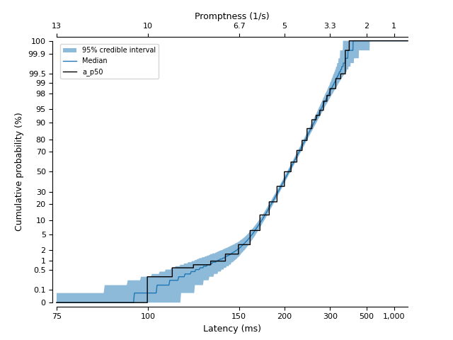

# pylater

A Python library for working with LATER ('Linear Approach to Threshold with Ergodic Rate for Reaction Times') models using Bayesian methods in [PyMC](https://www.pymc.io).
LATER is a model for distributions of reaction times, such as the time take for a person to press a button or to move their eyes after the onset of a task demand (see Carpenter & Noorani, 2023, for an overview of the model and its applications).

This library provides four main features:

* A LATER distribution class that can be used in PyMC models (`pylater.LATER`).
* A visualisation helper to produce Matplotlib figures in the 'reciprobit' space used by LATER practitioners (`pylater.ReciprobitPlot`).
* An method for constructing models using default priors, with optional sharing of parameters across datasets in 'shift' or 'swivel' arrangements (`pylater.build_default_model`).
* Reaction time data digitised from Carpenter & Williams (1995) (`pylater.data.cw1995`).

An example of a reciprobit plot, showing a condition from Carpenter & Williams (1995) and a summary of its posterior retrodictive distribution:



> [!NOTE]
> Also see [LATERmodel](https://unimelbmdap.github.io/LATERmodel/) for an R package with a non-Bayesian implementation of LATER and with a [graphical interface](https://later.researchsoftware.unimelb.edu.au/).

## Installation

The library can be installed using `pip`:

```bash
pip install https://github.com/unimelbmdap/pylater
```

## Quickstart

See the [documentation](https://unimelbmdap.github.io/pylater/) for more information.

```python
import pymc as pm
import pylater

# load the data from the 50% condition from participant a
data = pylater.data.cw1995["a_p50"]

# build a default PyMC model
model = pylater.model.build_default_model(datasets=[data])

# sample prior predictives
with model:
    idata = pm.sample_prior_predictive()

# visualise prior predictives using a reciprobit plot
priors_plot = pylater.ReciprobitPlot()
priors_plot.plot_predictive(idata=idata, predictive_type="prior")

# sample a posterior
with model:
    idata = pm.sample()

# look at posterior statistics
pm.stats.summary(data=idata)

# sample posterior predictives
with model:
    idata = pm.sample_posterior_predictive(trace=idata, extend_inferencedata=True)

# visualise posterior retrodictives using a reciprobit plot, with overlaid data
posterior_plot = pylater.ReciprobitPlot()
posterior_plot.plot_predictive(idata=idata, predictive_type="posterior")
posterior_plot.plot_data(data=data)
```

## Authors

* Damien Mannion, Melbourne Data Analytics Platform (MDAP), University of Melbourne
* Maria del Mar Quiroga, Melbourne Data Analytics Platform (MDAP), University of Melbourne
* Edoardo Tescari, Melbourne Data Analytics Platform (MDAP), University of Melbourne
* Andrew Anderson, Department of Optometry and Vision Sciences, University of Melbourne


## References

* Carpenter, R.H.S. & Noorani, I. (2023) LATER: The Neurophysiology of Decision-Making. Cambridge University Press. [doi: 10.1017/9781108920803](https://doi.org/10.1017/9781108920803)
* Carpenter, R.H.S. & Williams, M.L.L. (1995) Neural computation of log likelihood in control of saccadic eye movements. *Nature, 377* (6544), 59–62. [doi: 10.1038/377059a0](https://doi.org/10.1038/377059a0)
